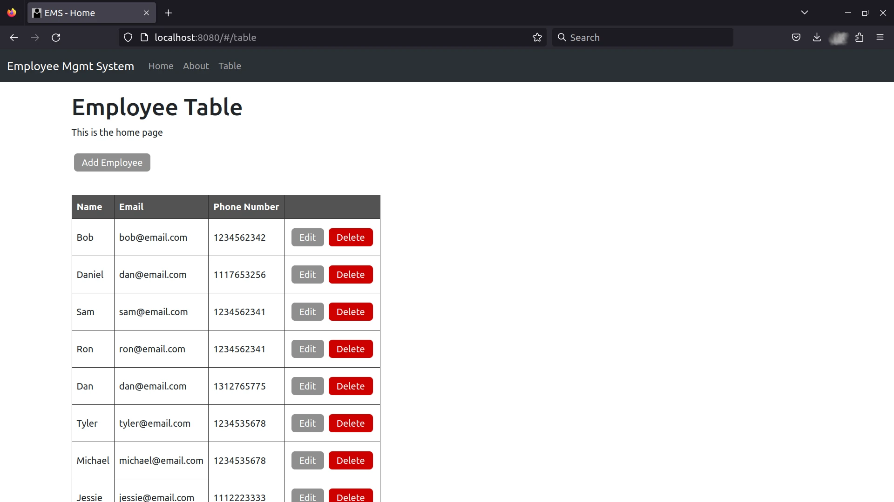

# Employee Management System
This is a program that provides a system to manage employees in a company or organization.



## Purpose
The purpose is for me to learn to use Spring Boot and Vue.js without Node.js in order to create a full stack web application.

## Operating System Dependencies
- Java 17
- Maven

Install these dependencies on Ubuntu:
```
sudo apt install openjdk-17-jdk openjdk-17-jre maven 
```

## Spring Boot Dependencies
- Spring Boot Dev Tools - **DEVELOPER TOOLS**
- Spring Web - **WEB**
- Rest Repositories - **WEB**
- Thymeleaf - **TEMPLATE ENGINES**
- Spring Data JPA - **SQL**
- H2 Database - **SQL**
- MySQL Driver - **SQL**

## Commands for Utilizing the API
### CRUD Operations
#### Add employee - (CREATE)
```  
curl -X POST localhost:8080/employee/add -H 'Content-Type: application/json' -d '{"name":"Bob","email":"[bob@email.com](mailto:bob@email.com)", "phone_number": "1234567890"}'  
```  

#### Fetch employee data - (READ)
```  
curl localhost:8080/employee/fetch?id=1
```  

#### Edit employee data - (UPDATE)
```  
curl -X PATCH localhost:8080/employee/update -H 'Content-Type: application/json' -d '{"id": 2952, "name":"John","email":"[john@email.com](mailto:john@email.com)", "phone_number": "1112223333"}'  
```  

#### Delete employee - (DELETE)
```  
curl -X DELETE localhost:8080/employee/delete -d id=2902  
```

Fetch a list of all employees
```  
curl localhost:8080/employee/fetch-all 
```  

## Resources
- [Building an Application with Spring Boot](https://spring.io/guides/gs/spring-boot/)
- [Building a RESTful Web Service](https://spring.io/guides/gs/rest-service/)
- [Serving Web Content with Spring MVC](https://spring.io/guides/gs/serving-web-content/)
- [Accessing Data with JPA](https://spring.io/guides/gs/accessing-data-jpa/)
- [Accessing data with MySQL](https://spring.io/guides/gs/accessing-data-mysql/)
- [Accessing JPA Data with REST](https://spring.io/guides/gs/accessing-data-rest/)
